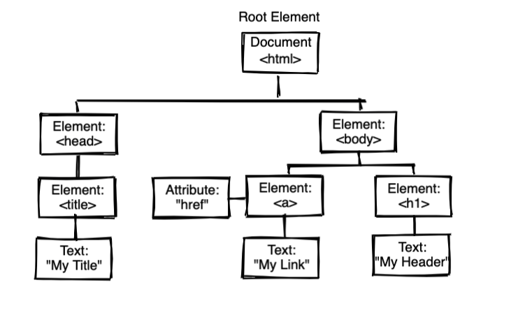

# Writing & Presentation Test Week 2
##### Muh Zaki Choiruddin 
##### Backend Web Development Track | Skilvul Tech4Impact

Assalamu'alaikum Wr. Wb. Di markdown ini saya akan menjelaskan berbagai materi yang telah saya pelajari selama mengikuti kegiatan `Kampus Merdeka Skilvul Tech4Impact pada track Backend Web Development`.

## Table of Contents
  - [Function](#function)
    - [Pengertian](#pengertian)
    - [Syntax](#syntax)
    - [Parameter dan Argumen](#parameter-dan-argumen)
  - [Scope](#scope)
    - [Pengertian](#pengertian-1)
    - [Global Scope](#global-scope)
    - [Local Scope](#local-scope)
  - [Data Type Built in Prototype & Method](#data-type-built-in-prototype--method)
    - [Data Types](#data-types)
    - [String](#string)
    - [Number](#number)
    - [Math](#math)
  - [DOM](#dom)
    - [DOM Traversal](#dom-traversal)
    - [DOM Manipulation](#dom-manipulation)
    - [DOM Events](#dom-events)

## Function
### Pengertian
Function adalah blok atau kumpulan kode dalam sebuah grup yang berfungsi untuk menyelesaikan suatu task. Function bersifat reusable, artinya dapat digunakan secara berulang sehingga tidak perlu menulis kode yang sama pada tempat yang berbeda (DRY - Don't Repeat Yourself).

### Syntax
Function di Javascript dapat dibuat dengan menulis kode berikut:
```sh
function welcome() {
    return "Hello! Good Morning."
}
```

Atau dengan `arrow function` (ES6).
```sh
const welcome = () => {
    return "Hello! Good Morning."
}
```


Sedangkan untuk memanggil function cukup tuliskan nama function tersebut diikuti dengan `()`.
```sh
welcome()
```

### Parameter dan Argumen
Parameter berfungsi agar sebuah function dapat menerima inputan data dari luar. Contohnya disaat membuat function penjumlahan 2 bilangan seperti berikut:
```sh
function additional(a, b) {
    return a+b
}
```
Lalu ada argumen yakni nilai yang ingin digunakan dalam sebuah function. Jumlah argumen harus sama dengan jumlah parameternya.
```sh
additional(10, 6)
```
Kita dapat membuat sebuah default value pada parameter, contohnya:
```sh
function welcome(name = "Zaki") {
    return `Hello ${name}`!
}

welcome() // output: Hello Zaki!
welcome("Meisha") // output: Hello Meisha!
```
## Scope
### Pengertian
Scope adalah konsep untuk menentukan apakah suatu variabel bisa diakses pada bagian tertentu atau tidak. Gambarannya seperti: Kita semua bisa melihat bintang-bintang dilangit karena bumi bersifat global. Namun jika kamu tinggal di Bandung, kamu tidak akan bisa melihat monas yang berada di jakarta. Monas bersifat local yaitu hanya berada di Jakarta.

### Global Scope
Global scope adalah suatu variabel dapat diakses dimanapun dalam suatu file. Agar menjadi Global Scope, suatu variabel harus dideklarasikan diluar blocks function.
```sh
let text = "Hello everybody!"

const greeting = () => {
    return text // "Hello everybody!"
}

return text // "Hello everybody!"
```

### Local Scope
Local scope adalah variabel yang dideklarasikan di dalam blocksfunction, conditional, dan looping. Sehingga variabel tersebut hanya dapat diakses di dalam blocks saja. Tidak bisa diakses diluar blocks.
```sh

const greeting = () => {
    let text = "Hello everybody!"
    return text // "Hello everybody!"
}

greeting() // "Hello everybody!"
return text // Uncaught ReferenceError: text is not defined
```

## Data Type Built in Prototype & Method
### Data Types
Hampir semua bahasa pemorgraman memiliki berbagai macam tipe data bawaan begitu juga dengan Javascript. Tipe data dibagi menjadi dua kategori yakni:
#### Primitive
Tipe data primitive disimpan berdasarkan nilai. Artinya, setiap kali kita memutuskan untuk mendeklarasikan variabel baru menggunakan tipe data primitif, kita membuat alamat baru di memori untuk nilai tersebut. (Numbers, Strings, Booleans, undefined, null)
```sh
let a = 10
let b = a
```
Tipe data variabel a adalah integer yang memiliki nilai 10. Variabel b juga merupakan integer yang berisi nilai dari variabel a yakni 10. Namun, apa yang disimpan oleh variabel b bukanlah variabel a itu sendiri tetapi nilai dari variabel tersebut. Selanjutnya jika nilai variabel a diganti maka tidak mempengaruhi nilai variabel b, ini yang disebut dengan primitive.
#### Non Primitive
Tipe data primitive disimpan menggunakan sebuah pointer atau alamat referensi pada memori.
```sh
let a = [10]
let b = a
console.log(a === b) // true

a.push(5)
console.log(a) // [10, 5]
console.log(a === b) // true
```
Tipe data variabel a adalah array yang memiliki value 10. variabel b berisi variabel a yang berarti mereka memiliki value yang sama. Selanjutnya dilakukan perubahan pada variabel a dengan menambahkan value 5 ke dalam array. Namun yang terjadi pada variabel b, dia akan ikut memiliki value 10 dan 5. Inilah yang disebut referensi (non primitive).

### String
#### Pengertian
String digunakan untuk menyimpan data bentuk `angka, huruf, karakter`.
```sh
const welcome = "Hello my name is Zaki!"
const welcome = 'Hello my name is Zaki!'
const welcome = `Hello my name is Zaki!`
```

#### toLowerCase()
Berfungsi untuk mengubah huruf menjadi kecil semua.
```sh
const welcome = "Hello my name is Zaki!"

console.log(welcome.toLowerCase())
// "hello my name is zaki!"
```

#### toUpperCase()
Berfungsi untuk mengubah huruf menjadi besar semua.
```sh
const welcome = "Hello my name is Zaki!"

console.log(welcome.toUpperCase())
// "HELLO MY NAME IS ZAKI!"
```

#### slice()
Berfungsi untuk mengekstrak bagian tertentu tanpa mengubah nilai string sebelumnya.
```sh
const str = 'The quick brown fox jumps over the lazy dog.';

console.log(str.slice(4, 19));
// "quick brown fox"
```

#### indexOf()
Digunakan untuk mencari letak index suatu string.
```sh
const welcome = "Hello my name is Zaki!"

console.log(welcome.indexOf("Zaki"))
// 17
```

### Number
#### Pengertian
Tipe data untuk menyimpan sebuah angka.
```sh
Number("123"); // returns the number 123
Number("123") === 123; // true

Number("unicorn"); // NaN
Number(undefined); // NaN
```

#### isFinite()
Digunakan untuk memeriksa apakah bilangan tersebut berhingga.
```sh
console.log(Number.isFinite(6 / 0));
// false

console.log(Number.isFinite(15 / 5));
// true

console.log(Number.isFinite(0 / 0));
// false
```

#### isInteger()
Untuk memeriksa apakah bilangan tersebut adalah bilangan bulat.
```sh
console.log(Number.isInteger(20))
// true

console.log(Number.isInteger(12.4))
// false
```

#### toString()
Berfungsi untuk mengekstrak bagian tertentu tanpa mengubah nilai string sebelumnya.
```sh
console.log((34).toString());     // '34'
console.log((11.3).toString());   // '11.3'
```

#### indexOf()
Digunakan untuk mencari letak index suatu string.
```sh
const welcome = "Hello my name is Zaki!"

console.log(welcome.indexOf("Zaki"))
// 17
```

### Math
#### Pengertian
Math adalah built-in object yang memiliki properti dan method untuk perhitungan matematika.

#### floor()
Digunakan untuk membulatkan angka kebawah.
```sh
console.log(Math.floor(5.95));
// 5

console.log(Math.floor(5.05));
// 5

console.log(Math.floor(-5.05));
// -6
```

#### max()
Digunakan untuk mencari angka tersebesar.
```sh
Math.max(10, 20); // 20
Math.max(-10, -20); // -10
Math.max(-10, 20); // 20
```

#### random()
Digunakan untuk mendapatkan angka acak.
```sh
console.log(Math.random())
// get random number
```

#### sqrt()
Digunakan untuk mendapatkan hasil akar kuadrat dari suatu angka.
```sh
Math.sqrt(9); // 3
```

## DOM
DOM kepanjangan dari Document Object Model adalah representasi data dari objek yang terdiri dari struktur dan konten dokumen di web. DOM bukan bagian dari JavaScript, melainkan browser (Web API).



### DOM Traversal
Contoh HTML yang akan kita guanakan
```sh
<div class="grandparent" id="grandparent">
    <div class="parent" id="parent-1">
        <div class="child" id="child-1">
        </div>
        <div class="child" id="child-2">
        </div>  
    </div>
</div>
```
#### getElementById
Digunakan untuk memilih element HTML berdasarkan `id`.
```sh
const el = document.getElementById("grandparent")
```

#### getElementsByClassName 
Digunakan untuk memilih element HTML berdasarkan `class`. Ini akan menghasilkan array
```sh
const el = document.getElementsByClassName("child")
```

#### querySelector
Digunakan untuk memilih element HTML berdasarkan `class` atau`id`. Jika ingin mengambil berdasarkan class tambahkan `.` (titik), jika berdasarkan id tambahkan `#` (hashtag) di awal.
```sh
// dengan class
const grandparent = document.querySelector(".grandparent")

// dengan id
const child1 = document.querySelector("#child-1")
```

#### parentElement
Digunakan untuk mengambil element di atas/ yang mengurungnya nya.
```sh
const parent1 = document.querySelector("#parent-1")

const grandparent = parent1.parentElement
// <div class="grandparent" id="grandparent">
```

#### previousElementSibling 
Digunakan untuk mengambil element yang sejajar di sebelah kirinya atau sebelumnya.
```sh
const child2 = document.querySelector("#child-2")

const prev = child2.previousElementSibling
// <div class="child" id="child-1">
```

#### nextElementSibling 
Digunakan untuk mengambil element yang sejajar di sebelah kanannya atau setelahnya.
```sh
const child1 = document.querySelector("#child-1")

const prev = child1.nextElementSibling
// <div class="child" id="child-2">
```

### DOM Manipulation
Dengan DOM kita juga dapat melakukan berbagai macam manipulasi seperti mengganti text, membuat element serta menambahkan style.

#### innerHTML
Digunakan untuk menyisipkan kode HTML.
```sh
// html
<p id="text"></p>

// javascript
document.getElementById("text").innerHTML = "Hello Zaki!";
```

#### attribute
Digunakan untuk mengubah attribute di sebuah tag HTML.
```sh
// html


// javascript
document.getElementById("image").src = "https://picsum.photos/";
```

#### createElement
Berfungsi untuk membuat sebuah element baru yang dapat disisipkan ke dalam HTML.
```sh
// html
<div id="blank">
</div>

// javascript
const paragraph = document.createElement("p");
paragraph.innerHTML = "This is new element.";
document.getElementById("blank").appendChild(paragraph);

// maka tag p akan masuk di dalam div dengan id blank
// html
<div id="blank">
    <p>This is new element.</p>
</div>
```

#### remove
Berfungsi untuk menghapus sebuah element di HTML.
```sh
// html
<div id="blank">
</div>

// javascript
const element = document.getElementById("blank");
element.remove();
```

#### style
Digunakan untuk memanipulasi style sebuah element.
```sh
// html
<p id="text">Hello Zaki!</p>

// javascript
const text = document.getElementById('text')
text.style.color = 'white';
text.style.backgroundColor = 'black';
```

### DOM Events
Events dapat digunakan untuk menangkap kejadian/ interaksi yang dilakukan pengguna pada sebuah element HTML. Contoh events yang sering dipakai adalah click, submit, change, hover dan scroll.

#### Penggunaan
Contohnya kita akan membuat form sederhana lalu ketika di click akan menampilkan sebuah alert yang berisi value inputan tersebut.
```sh
// html
<input id="name" value="" placeholder="IUnput your name">
<button id="submit">Send</button>

// javascript
const input = document.getElementById("name")
const button = document.getElementById("submit")

button.addEventListener("click", function() {
    alert(input.value)
})
```